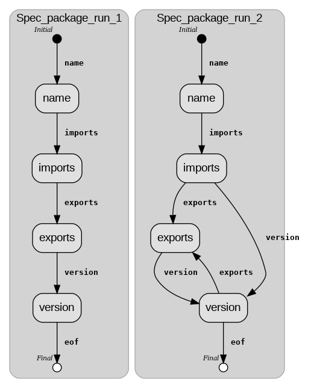

# Incubator: Learning the structure of structs, e.g. json objects (Grammatical Inference/Grammar Inference/Grammar Induction)

## What it is about?

Consider a sequence of structs, e.g. json objects, C++ structs etc. :

```
testset_of_structs = 
A{
    B{123;};
    C{"a string";};
}

...

A{
    G{42;};
    C{"another string";};
}

A{
    F{1;2;3;4;};
    C{12.3;};
}
```

We implement a set of algorithms which take  *testset_of_structs* as input and output a 'model'- e.g. a grammar, state machine etc. - which 'explains' the input sequence.


## Install cepS

- Install ceps (https://github.com/cepsdev/machines4ceps)
- Clone this repo. Assumption: repo ends up in the same directory which also contains ceps, machines4ceps, log4ceps.
- If necessary edit build_all.sh/rebuild_all.sh, i.e. set the values of CEPSCORE, MACHINES4CEPS, LOG4CEPS according to your configuration.
- $ cd repo
- $ ./rebuild_all.sh && ./run_test.sh test/simple_test.ceps

## State of development

### Step 1

Construct a simple state machine which generalizes the input 'conservatively'. 

Test is in test/base.ceps.


