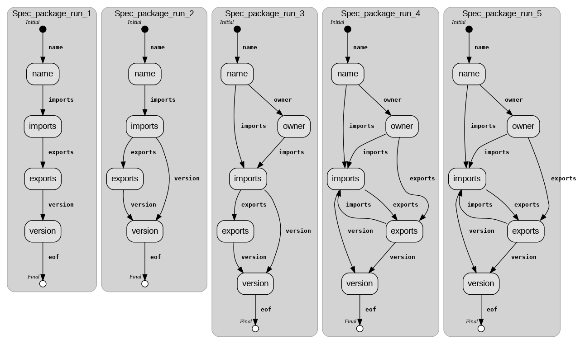
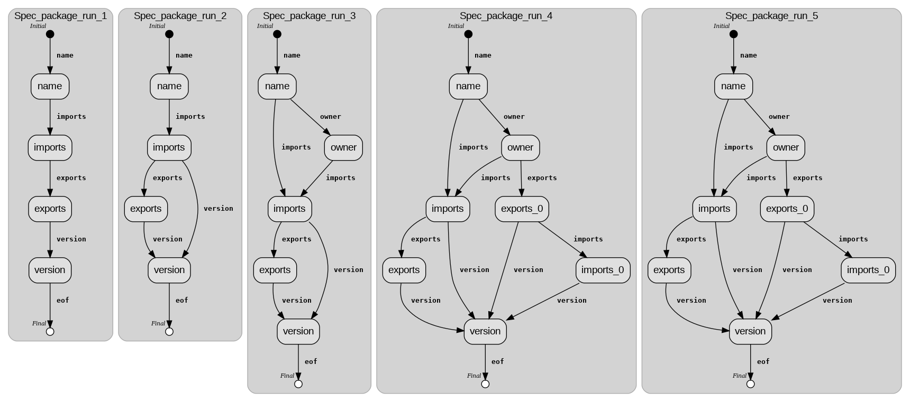
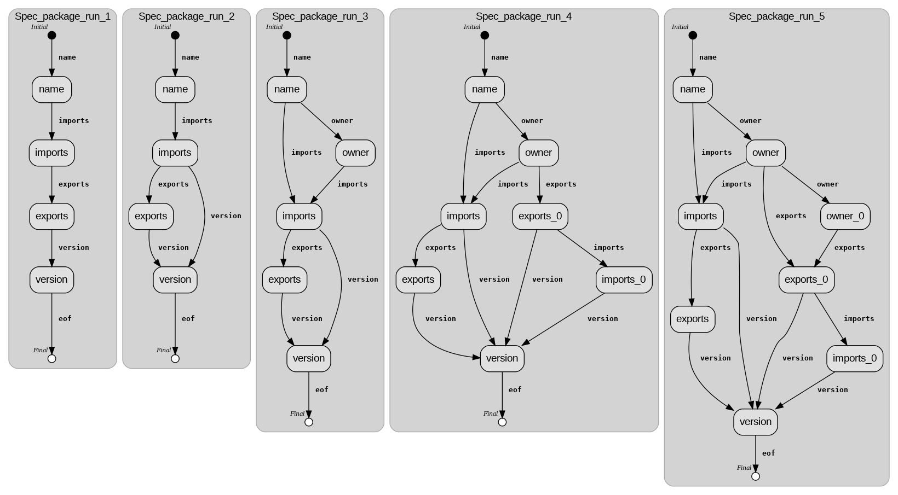

# Incubator (cepS): Learning the structure of structs, e.g. json objects (Grammatical Inference/Grammar Inference/Grammar Induction)

## What it is about?

Consider a sequence of structs, e.g. json objects, C++ structs etc. :

```
testset_of_structs = 
A{
    B{123;};
    C{"a string";};
}

...

A{
    G{42;};
    C{"another string";};
}

A{
    F{1;2;3;4;};
    C{12.3;};
}
```

We implement a set of algorithms which take  *testset_of_structs* as input and output a 'model'- e.g. a grammar, state machine etc. - which 'explains' the input sequence.


## Install cepS

- Install ceps (https://github.com/cepsdev/machines4ceps)
- Clone this repo. Assumption: repo ends up in the same directory which also contains ceps, machines4ceps, log4ceps.
- If necessary edit build_all.sh/rebuild_all.sh, i.e. set the values of CEPSCORE, MACHINES4CEPS, LOG4CEPS according to your configuration.
- $ cd repo
- $ ./rebuild_all.sh && ./run_test.sh test/simple_test.ceps

## State of development

### Step 1

Construct a simple state machine which generalizes the input 'conservatively'. 

Test is in test/base.ceps.



#### Comment

In step 4 the algorithm overgeneralizes by allowing an unbounded sequence of alternating imports/exports substructures. Need Fix.

### Step 2



Comment:

Learning 
```
 package{
        name{"a name";};
        owner{"Smith";};
        exports{E1;};
        imports{M1;M2;M3;};
        version{1;};
    };

```
doesn't lead to a cycle *exports <-> import* now, the involved states in a direct cycle are split now. The algorithm 'learns' that a single *exports* can be followed/preceded by a single *imports* and __not__ that an unbounded number of juxtaposed imports/exports are allowed. Last step still wrong (as depicted by 
the picture at the verry right).

### Step 3

Missing: Learning multiple juxtaposed occurences of the same element. Seeing the following struct

```
    package{
        name{"a name";};
        owner{"Smith";};
        owner{"Multiple owners allowed.";};
        exports{E1;};
        imports{M1;M2;M3;};
        version{1;};
    };
```

the algorithm should learn that there can be up to two *owner*-fields:




